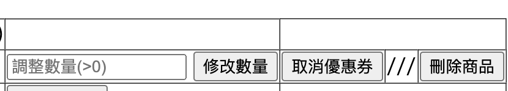

# 題目二：
- 請你設計出購物車的函式庫，至少包含一個以上的物件，此函式庫必須包含以下功能：

### 提示：

可以先用 seeder 增加 product
```
php artisan migrate --seed
```

### 欄位資訊：

1. 商品：
        品名、單價、數量、折扣金額、總計金額
        

2. 優惠折扣：
        優惠名稱、折扣金額
        

### 購物車功能：

1. 商品的 CRUD：
- 新增商品
選擇「加入購物車」

- 移除商品
- 更新商品數量



2. 優惠折扣
- 單一品項增加優惠折扣
- 單一品項移除優惠折扣


取得購物車內商品清單(顯示品名、數量、單價、折扣金額 & 優惠名稱、結帳金額)

取得購物車總共金額（如下圖示）

### 注意：

每一個商品都只能新增一個優惠折扣，一但有重複加入的狀況，需提示已使用優惠折扣，並且無法加入優惠折扣。

優惠折扣至少需做到扣除金額與打折的功能。
--
