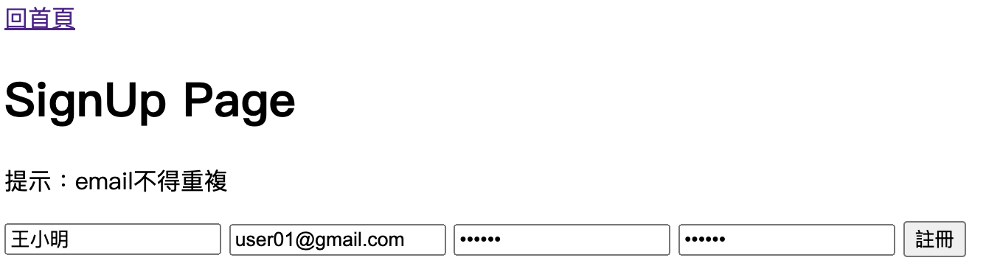
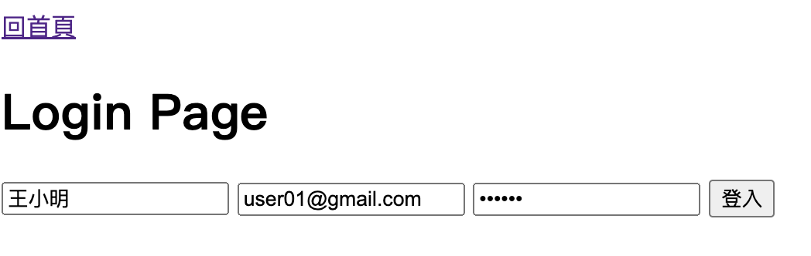
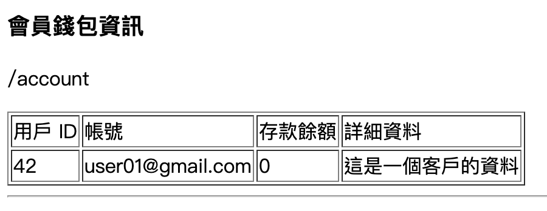
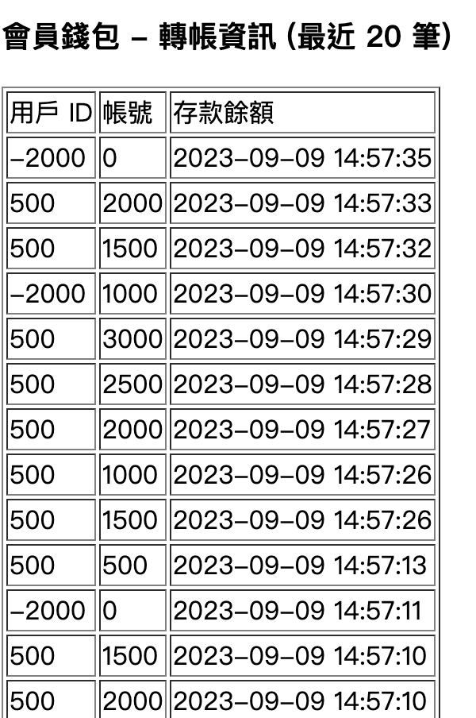
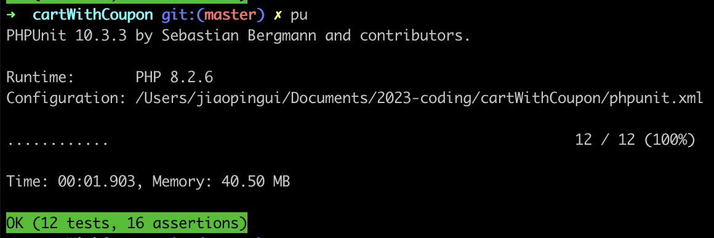

題目三：

請您使用 Laravel 建立一個 API 系統，此系統需具備以下功能：

1. 會員登入、註冊，至少需 account, password 欄位。






2. 帳戶存款的 CRUD 功能，至少需要兩張表。
    a. accounts：紀錄使用者帳號、目前存款餘額。

    

        web.php
        ```
            /**
            * testMoneySave
            */
            Route::put('account/save', [AccountController::class, 'save'])->name('account.save');
            /**
            * testMoneyWithdraw
            */
            Route::put('account/withdraw', [AccountController::class, 'withdraw'])->name('account.withdraw');
        ```

    b. balances：紀錄使用者存取款紀錄。

        

        web.php
        ```
            /**
            * testGetData (get balance data)
            */
            Route::get('api/balance', [BalanceController::class, 'getData'])->name('getDataBalance');
        ```


測驗注意事項：

以上測驗題目皆需實作單元測試。


完成後請回覆信件並且附上 github 連結。